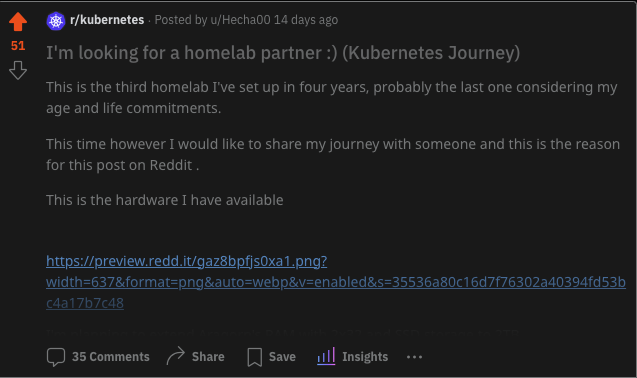
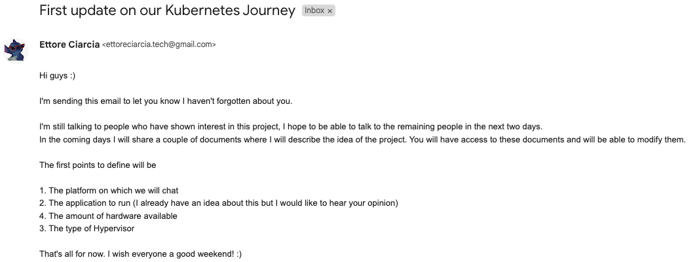
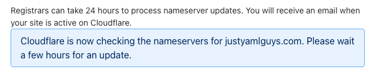

# History of JustYAMLGuys

## Genesis (30 April 2023)

Sunday April 30 2023, 03:03:23 PM Central European Summe Time. This post appears on Reddit

A few people have shown interest in sharing their homelab to play with CNCF projects.

A few people scattered around the world, on totally different timezones.

___

## First email (6 May 2023)

Having to democratically decide the platform on which we would speak, we started talking via email :)

___

## Name & Discord Channel (12 May 2023)

With a majority of 3 votes, the name decided for the group is Just YAML Guys.

On 12 May 2023 at 12:17 The first message has been sent on our Discord channel!

___

## Registered the domain justyamlguys.com (21 May 2023)

___

## Official email, AWS account and Cloudflare account! (27 May 2023)

Created our official mail justyamlguys@gamil.com

Created our aws account

Created our Cloudflare account

## Nameserver records created (26 May 2023)

Nameserver records have been changed on the domain registrar (Google) to make Cloudflare our public DNS for 'justyamlguys.com'.
___

## Our headscale is finally up! (28 May 2023)

