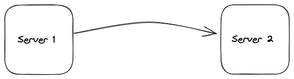

## Physical Server

|  Name	|  IP	|  RAM	|  vCPU	| Disk Size | CPU Model	|  OS 	|
|---	|---	|---	|---	|---	|---	|---	|
| Example     |  192.168.0.2 |  4 GB  |  4 vCPU  |  250 GB   |  ARM Cortex-A72       |  Debian 11    | 
| Example	|  192.168.0.10	|  8 GB	 |  8 vCPU	|  250 GB   |  i5 1135G7	        |  Proxmox 7.2  |
| Example 	|  192.168.0.20	|  16 GB | 12 vCPU 	|  250 GB	|  AMD Ryzen 5 2600X	|  Proxmox 7.2	|
| Example	|  192.168.0.30	|  4 GB	 |  4 vCPU  |  250 GB	|  i5-3337U 	        |  Ubuntu 22.04	|

___

## Tech stack

<table>
    <tr>
        <th>Logo</th>
        <th>Name</th>
        <th>Description</th>
    </tr>
    <tr>
        <td></td>
        <td><a href="https://www.ansible.com">Ansible</a></td>
        <td>Automate bare metal provisioning and configuration</td>
    </tr>
    <tr>
        <td></td>
        <td><a href="https://argoproj.github.io/cd">ArgoCD</a></td>
        <td>GitOps tool built to deploy applications to Kubernetes</td>
    </tr>
    <tr>
        <td></td>
        <td><a href="https://cert-manager.io">cert-manager</a></td>
        <td>Cloud native certificate management</td>
    </tr>
    <tr>
        <td></td>
        <td><a href="https://www.cloudflare.com">Cloudflare</a></td>
        <td>DNS and Tunnel</td>
    </tr>
    <tr>
        <td></td>
        <td><a href="https://www.docker.com">Docker</a></td>
        <td>Ephemeral PXE server and convenient tools container</td>
    </tr>
    <tr>
        <td></td>
        <td><a href="https://github.com/kubernetes-sigs/external-dns">ExternalDNS</a></td>
        <td>Synchronizes exposed Kubernetes Services and Ingresses with DNS providers</td>
    </tr>
    <tr>
        <td></td>
        <td><a href="https://getfedora.org/en/server">Fedora Server</a></td>
        <td>Base OS for Kubernetes nodes</td>
    </tr>
    <tr>
        <td></td>
        <td><a href="https://gitea.com">Gitea</a></td>
        <td>Self-hosted Git service</td>
    </tr>
    <tr>
        <td></td>
        <td><a href="https://grafana.com">Grafana</a></td>
        <td>Operational dashboards</td>
    </tr>
    <tr>
        <td></td>
        <td><a href="https://helm.sh">Helm</a></td>
        <td>The package manager for Kubernetes</td>
    </tr>
    <tr>
        <td></td>
        <td><a href="https://k3s.io">K3s</a></td>
        <td>Lightweight distribution of Kubernetes</td>
    </tr>
    <tr>
        <td></td>
        <td><a href="https://kubernetes.io">Kubernetes</a></td>
        <td>Container-orchestration system, the backbone of this project</td>
    </tr>
    <tr>
        <td></td>
        <td><a href="https://grafana.com/oss/loki">Loki</a></td>
        <td>Log aggregation system</td>
    </tr>
    <tr>
        <td></td>
        <td><a href="https://longhorn.io">Longhorn</a></td>
        <td>Cloud native distributed block storage for Kubernetes</td>
    </tr>
    <tr>
        <td></td>
        <td><a href="https://metallb.org">MetalLB</a></td>
        <td>Bare metal load-balancer for Kubernetes</td>
    </tr>
    <tr>
        <td></td>
        <td><a href="https://www.nginx.com">NGINX</a></td>
        <td>Kubernetes Ingress Controller</td>
    </tr>
    <tr>
        <td></td>
        <td><a href="https://prometheus.io">Prometheus</a></td>
        <td>Systems monitoring and alerting toolkit</td>
    </tr>
    <tr>
        <td></td>
        <td><a href="https://www.whitesourcesoftware.com/free-developer-tools/renovate">Renovate</a></td>
        <td>Automatically update dependencies</td>
    </tr>
    <tr>
        <td></td>
        <td><a href="https://tekton.dev">Tekton</a></td>
        <td>Cloud native solution for building CI/CD systems</td>
    </tr>
    <tr>
        <td></td>
        <td><a href="https://trow.io">Trow</a></td>
        <td>Private container registry</td>
    </tr>
    <tr>
        <td></td>
        <td><a href="https://www.vaultproject.io">Vault</a></td>
        <td>Secrets and encryption management system</td>
    </tr>
    <tr>
        <td></td>
        <td><a href="https://zerotier.com">ZeroTier</a></td>
        <td>VPN without port forwarding</td>
    </tr>
</table>

___

## Network Topology

You can create your drawing using [Excalidraw](https://excalidraw.com/)

## Links to stores to buy the hardware you use

- [RAM 2x8 BLABLA - Amazon](https://google.com)
- [CASE - ebay](https://google.com)
- [Mothrerboard - ebay](https://google.com)
- [CPU - Amazon](https://google.com)
- [Switch - Amazon](https://google.com)
- [Router Amazon](https://google.com)

