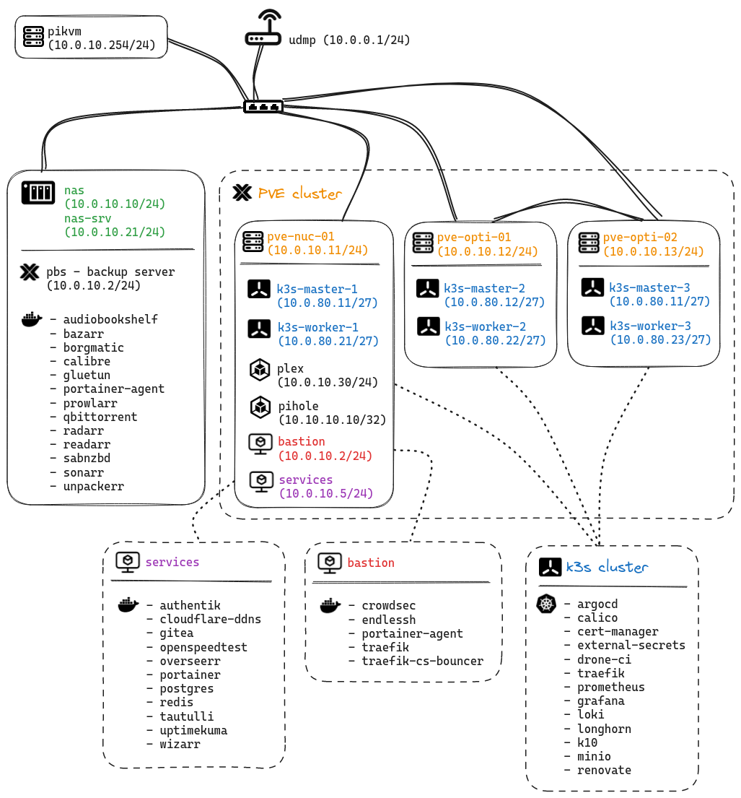

# Homelab

[](https://drone.k8s.sbbh.cloud/sysadm/homelab)

## ⚠️

Work in progress

## 🔧 Hardware

| Device                      | OS Disk Size | Data Disk Size         | Cores | Ram  | Operating System | Purpose                 |
|-----------------------------|--------------|------------------------|-------|------|------------------|-------------------------|
| NUC 12 Pro (i7 1260P)       | 1TB SSD      | 1x 500GB SSD           | 16    | 64GB | Proxmox          | VMs                     |
| Dell Optiplex (i5-8500T)    | 1TB SSD      | 1x 500GB SSD           | 6     | 32GB | Proxmox          | VMs                     |
| Dell Optiplex (i5-6500T)    | 256GB SSD    | 1x 500GB SSD           | 4     | 16GB | Proxmox          | VMs                     |
| Synology 220+               | -            | 2x 6TB HDD             | 2     | 6GB  | -                | Data / Containers / VMs |
| RPi 4                       | 32GB         | -                      | 4     | 4GB  | PiKVM            | Network KVM                     |
| RPi 4                       | 32GB         | -                      | 4     | 4GB  | -                | -                       |
| NUC 8 (i5 8259U)            | 256GB SSD    | -                      | 8     | 8GB  | -                | -                       |

### 📶 Networking

| Name                                          | CIDR           |
|-----------------------------------------------|----------------|
| Management VLAN                               | `10.0.0.0/24`  |
| Servers VLAN                                  | `10.0.10.0/24` |
| Kubernetes VLAN                               | `10.0.80.0/24` |
| DNS VLAN                                      | `10.10.10.0/24`|

## 👨‍🎨 Infrastructure



## 📂 Repository Structure

```text
📁 homelab
├──📁 ansible
│   ├──📁 apps
│   ├──📁 playbooks
│   ├──📁 roles
│   └──📁 tasks
├──📁 k8s
│   └──📁 apps
│       ├──📁 argocd
│       ├──📁 kube-system
│       ├──📁 networking
│       ├──📁 security
│       └──📁 storage
└──📁 tf
    └──📁 k3s
```

### 🖥️ Core Components - Kubernetes

- [argo-cd](https://argo-cd.readthedocs.io/en/stable/): Continuous deployment tool used to deploy manifests/charts from git to my homelab
- [authentik](https://goauthentik.io/): SSO for the services that support LDAP/SAML/OIDC.
- [cert-manager](https://cert-manager.io/docs/): Creates SSL certificates for services in my Kubernetes cluster.
- [external-secrets](https://external-secrets.io/main/): Used to store my secrets in a reversible way so DR is trivial.
- [traefik](https://github.com/traefik/traefik/): Ingress controller to expose HTTP traffic to pods over DNS.
- [metallb](https://metallb.universe.tf/): Load balancer provisioning service for bare metal LBs

